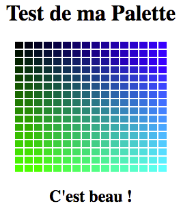

# TP : Java Servlets

## Objectifs

- Paramétrer et installer l’environnement nécessaire à l’exécution de Servlets. 
- Ecrire et tester des servlets rudimentaires. 
- Faire le lien entre une servlet et une base de données.


## Installation de l’environnement

- Récupérer et décompresser le contenu du fichier [apache-tomcat-9.0.12.zip](http://wwwftp.ciril.fr/pub/apache/tomcat/tomcat-9/v9.0.12/bin/apache-tomcat-9.0.12.zip). Il s'agit du serveur Java qui nous sera utile pour faire du développement web.
Notez également l'emplacement et la version du __JDK__ installé, généralement dans "C:\program files\java\". Nous supposerons que vous avez installé une version __1.8.0__ ou supérieure.  
Afin de vérifier la bonne installation vous pouvez ouvrir une console est exécuter `java -version`.

Vérifiez aussi que vous êtes en mesure d'appeler le compilateur en éxécutant `javac -version`.  
Si ce n'est pas le cas, vous devez aussi configurer la variable "PATH" de votre système.

Configurons correctement deux variables d’environnement :  
- "CLASSPATH" : pour faciliter la compilation des servlets avec `javac`  
- "JAVA_HOME" : qui sera utile au serveur web tomcat

Vous devez mettre le contenu suivant dans ces variables d'environnement (en l'adaptant à votre situation).

CLASSPATH=.;E:\tomcat\lib\servlet-api.jar  
JAVA_HOME=C:\program files\java\jdk1.8.0_172

1. Récupérez le fichier [vide.zip](https://github.com/pmathieufr/dut_prog_web/raw/master/cours02/exercices/vide.zip) et décompressez le dans le répertoire webapps de Tomcat. Il s'agit d'un contexte web de base.  

1. Les scripts de lancement de Tomcat se trouvent dans tomcat\bin. Les fichiers "bat" sont utilisés sous windows alors que les fichiers "sh" sont utilisés sous linux et mac. Il y en a deux scripts différents :  
— `startup.bat` lancera le serveur en tache de fond et placera les erreurs dans un fichier de log.  
— `catalina.bat run` lancera le serveur en avant plan affichant les erreur dans la console.  
Démarrez votre serveur Tomcat. Dans sa configuration standard ce serveur utilise le port 8080.  
Il faudra donc qu'aucun autre programme sur votre système n'utilise ce port.  

1. Si tout s’est bien passé, l’environnement necessaire est maintenant configuré.

## Test de la configuration

Lancez Firefox (ou autres) et accédez à votre serveur à l’adresse http://localhost:8080/vide. La page de test doit s’afficher correctement.  
__Attention__: Si vous utiliser un proxy (c'est le cas à l'université de Lille), il faudra soit le désactiver dans votre navigateur, soit indiquer que vous ne l'utilisez pas pour "localhost" dans les paramètres réseau.


## Ma première page HTML

Créez dans le répertoire `tomcat/webapps/vide` une page HTML nommée `essai.html`.

```html
<HTML>
<HEAD>
  <TITLE>Essai</TITLE>
  <META http-equiv="Content-Type" content="text/html; charset=UTF-8"/>
</HEAD>
<BODY> Voici ma première page sur mon propre serveur </BODY>
</HTML>
```

Vous pouvez y accéder par l’URL http://localhost:8080/vide/essai.html

Tomcat fournit en effet tous les fichiers présents dans le répertoire du contexte.  
Par sécurité, il n'est par contre pas possible d'accéder au contenu du répertoire WEB-INF.

Pour le moment, nous ne faisons que transmettre un fichier au navigateur.  
Voyons comment exécuter du code java lorsque l'on appelle tomcat.

## Ma première compilation

L’archive qui vous a été donnée contient une page `Test.html` qui appelle une servlet `Test.java`. Une erreur s’est glissée dans chacun de ces programmes. Faites en sorte que tout fonctionne bien<sup>1</sup>.

Ce test n’est pas anodin ! Si vous êtes arrivés ici, c’est que le serveur web, le moteur de servlets, le réseau, le proxy, les variables d’environnement système sont tous bien réglés et que vous savez compiler et exécuter une Servlet !


## Création de ma propre servlet

Créez dans le répertoire `vide/WEB-INF/classes` la servlet `First.java`

```java

import java.io.*;
import javax.servlet.*;
import javax.servlet.http.*;
import javax.servlet.annotation.WebServlet;

@WebServlet("/servlet-First")
public class First extends HttpServlet
{
  public void service( HttpServletRequest req, HttpServletResponse res )
  throws ServletException, IOException
  {
    res.setContentType("text/html;charset=UTF-8");
    PrintWriter out = res.getWriter();
    out.println( "<head><title>servlet first</title>" );
    out.println( "<META content=\"charset=UTF-8\"></head><body><center>" );
    out.println( "<h1>Test de ma Servlet</h1>" );
    out.println( "<h2>Super ! ça marche</h2>" );
    out.println( "</center> </body>" );
  }
}
```

Compilez cette servlet et appelez là directement à partir de votre navigateur : http://localhost:8080/vide/servlet-First

L'annotation `@WebServlet` permet de faire le lien entre un chemin indiqué dans le navigateur, et la classe java qui doit s'exécuter.  
Ce nom __doit__ commencer par "/". L'url d'accès à la servlet sera composée du nom de la webapp suivi de ce nom.


## Génération de html


L'exemple précédent aurait évidemment plus être écrit à l'aide d'une page html statique.  
Lorsque l'on doit générer une grande quantité de code html ou calculer des données, l'utilisation d'une servlet devient nécessaire.  

1. Ecrivez une servlet "Fibonacci" qui affiche les 30 premières valeurs de cette suite célèbre. La suite est définie par `f(n) = f(n-1) + f(n-2) avec f(0) = 0 et f(1) = 1`.  
Pour le dire plus simplement, les deux premiers nombres sont 1, puis les suivants sont la somme des deux nombres précédents. Le résultat à obtenir doit donc être :  
1 1 2 3 5 8 13 21 34 55 89 144 233 377 610 987 1597 2584 4181 6765 10946 17711 28657 46368 75025 121393 196418 317811 514229 832040  

1. Les couleurs peuvent être décrites en html à l'aide d'un code hexadécimal codé sur 3 ou 6 caractères représentant un mélange des trois couleurs primaires (rouge, vert, bleu). Ainsi, la couleur codée '#3f5' (rouge=3, vert=f, bleu=5) représente un mélange de 3/15e de rouge, 15/15e de vert et 5/15e de bleu. Sachant cela, Ecrivez une servlet "Palette" qui affiche un tableau html de 16 lignes (v alant de 0 à 15) et 16 colonnes (b allant de 0 à 15). Chaque cellule de ce tableau aura une couleur de fond dont la composante de rouge sera "0", les composantes verte et bleue seront fonction de la colonne (b) et de la ligne (v).  
Vous devriez obtenir quelquechose ressemblant à :  
  

1. Ecrivez une servlet "Ascii" qui affiche une page contenant une table des codes ASCII de 32 à 255 (par exemple sur deux colonnes, la première avec le code et la seconde avec la valeur).  
Pour cet exercice, enlevez le `charset=UTF-8` de la méthode `setContentType` et de la balise html `META`.  
Si votre navigateur le permet, vous pouvez essayer de faire varier l'encodage des caractères pour voir des différences (essentiellement à partir du caractère 127).


## Page web dynamique


1. Ecrivez une servlet `NouvelAn` qui affiche le nombre de secondes avant la prochaine année.  
Pour cela, vous pouvez importer et utiliser les objets des packages `java.time` et `java.time.temporal` fournis depuis Java 8.  

_exemple_

```java
LocalDateTime today = LocalDateTime.now();
LocalDateTime aprilFirst = LocalDateTime.of(2018, Month.APRIL, 1, 0, 0);
Duration delay = Duration.between(today, aprilFirst);
long seconds = delay.get( ChronoUnit.SECONDS );
```

Chaque appel à cette servlet doit donc logiquement générer un affichage différents. Ce n'était pas le cas des servlets écrites jusqu'à présent.


## Servlet en lien avec une base de données

Il est tout à fait possible, dans une servlet, d'afficher des données provenant d'un SGBD. C'est ce que font la majorité des applications web. Nous allons utiliser JDBC dans notre servlet.

Il faut tout d'abord placer le driver JDBC dans le répertoire `WEB-INF/lib` de votre contexte web.  
Tomcat se charge d'ajouter tous les jar présents à cet endroit dans son classpath lorsqu'il démarre.  


Exécutez les requêtes du fichier [foot.sql](https://github.com/pmathieufr/dut_prog_web/raw/master/cours02/exercices/foot.sql) sur votre base de données.  
Cela devrait créer des tables et des données pour la suite des exercices.


1. Ecrivez une servlet "ListeJoueurs" permettant d’afficher le contenu de la table JOUEURS, de la même manière que le programme Select.java écrit dans le TP précédent.  

1. Affichez tout ceci dans un tableau html avec les titres de colonnes dans des balises "TH".   

1. Modifier ListeJoueurs pour afficher un tableau de joueurs par club. Chaque nom de club sera affiché dans une balise "H2" avant les joueurs correspondants. <sup>2</sup> 

1. Mettre en rouge les joueurs qui ont plus de 30 ans au moment de l'affichage de la page.


---

<sup>1</sup> Vérifier les numéros de port et la forme des URL (relative / absolue).  
<sup>2</sup> Il est possible de trouver une solution pour le faire au moyen d'une seule requête SQL.   

