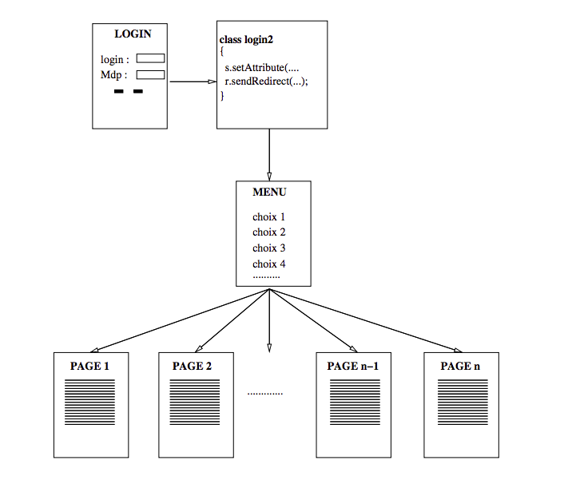

# Authentification

## Objectif

* Etre capable de mettre en place un mecanisme d’authentification

## Authentification basique

Pour cet exercice nous aurons besoin d'une table `personne` constituée des champs `login`, `mdp`, `nom`, `prenom`, `adresse`, `email`, `tel`, `datenaiss`, ... etc

Ecrire une page `login.html` contenant un formulaire de saisie du login et du mot de passe d’un utilisateur et qui appelle
une servlet `Authent.java` qui vérifie dans la base de données si cette personne existe ou non et qui redirige dans tous les cas vers une servlet  `servlet-Statut` qui se contente d'afficher "utilisateur connu du
SGBD" dans le cas positif et "Inconnu" dans le cas négatif. Afin de passer cette information entre ces deux pages, on la rangera dans la session de l'utilisateur.
1. Vérifiez qu’il n’y a ni `while` ni `equals` dans `Authent.java` (sinon vous réinventez la BDD !).
2. Vérifiez qu'un rechargement de `servlet-Statut`indique toujours la même phrase.
3. Quittez et relancez votre navigateur sur la page `servlet-Statut`. A priori vous devriez être à nouveau inconnu ! (quitter le navigateur fait perdre la session).
4. Affichez la console Web du navigateur; onglet "storage". Vous constatez que l'objet session se nomme JSESSIONID

## Site de gestion de joueurs
On souhaite réaliser une application web permettant à chaque joueur de s’identifier et d’accéder à sa fiche personnelle (et pas à celle des autres) de deux manières différentes : l’une en lecture et l’autre en écriture. 

Nous nous y prendrons en plusieurs étapes :
* Authentification de base
* Authentification évoluée
* Ajout de roles

### Authentification de base

Ecrire l’ensemble de pages permettant l’authentification d’un individu à partir de son login/mdp et l’accès à un menu simple permettant d’accéder à deux pages : l’une affichant ses coordonnées, l’autre permettant la saisie/modif de ses coordonnées. 

Il y a 6 pages à écrire :
* La page `login.html` : une simple page HTML contenant un formulaire de saisie du login et du mot de passe.
* La page `menu.html` : une simple page HTML contenant juste deux hyperliens, l’un vers `servlet-Lecture` et l’autre
vers `servlet-Modif`
* La page `servlet-Authent` qui s’occupe de l’authentification. Elle verifie que la personne est dans la base, si oui, on
range le login dans la session et on redirige vers `menu.html`, si non, on renvoie l’utilisateur à `login.html`.
* Les deux pages `servlet-Lecture`, triviale, qui affiche les coordonnées de la personne dont le login est dans la session
et `servlet-Modif` qui fonctionne de la même manière mais en mise-à jour. Pensez à afficher en titre de chacune de ces
pages le login de la personne.
* Une dernière page `servlet-Deconnecte` effectue un `session.invalidate()` afin de vous déconnecter (en réalité "tuer" la session).

### Authentification évoluée
1. Vous constatez avec l’exercice précédent que même si vous n’êtes pas connecté, il est possible d’accéder à `Lecture` ou
`Modif`.
2. Transformez le menu en servlet de manière à pouvoir tester dans chacune des 3 servlets que la personne s’est bien identifiée (présence du login dans la session).  
Une fois cet exercice terminé, il ne doit plus être possible d’accéder à `servlet-Lecture`, `servlet-Modif` ou `servlet-Menu` sans avoir été authentifié. Notamment, un utilisateur qui aurait "bookmarké" sa page de coordonnées doit se voir renvoyé
directement au login.

Vérifions le comportement à l'expiration de la session.
1. Rajoutez `session.setMaxInactiveInterval(10);` juste après la création de la session dans la servlet `Authent`.
Ceci règle la durée de vie de la session à 10 sec. Par défaut la durée de vie d’une session est de 1800 secondes, soit 30 minutes.
2. Authentifiez vous une première fois. Cliquez plusieurs fois sur `Modif` et `Lecture`. Vous constatez qu’il n’y a pas besoin d’une nouvelle authentification pour y accéder.
3. Attendez 10 secondes sans rien faire, puis rechargez la page. Normalement, vous devriez être automatiquement déconnectés et redirigés vers la page de login.

### Roles
En général, certains utilisateurs ont un statut spécial, un administrateur de site par exemple.
On ajoute maintenant une colonne `role` à la table. Ce champ peut contenir deux valeurs : `admin` pour l’administrateur et `util` le simple utilisateur.
* `util` : Le rôle util correspond à l’exercice prédédent. L’utilisateur ne peut voir et modifier QUE ses coordonnées.
* `admin` : le rôle admin permet de tout voir et de tout modifier. Faites en sorte d’utiliser les mêmes servlets dans les deux cas, avec un traitement en fonction du rôle.
Modifiez les servlets `Lecture` et `Modif` pour qu’elles prennent en compte ces deux rôles.
Une fois cet exercice terminé, vous devriez pouvoir donner n’importe quel role à n’importe qui avec prise en compte immédiate dans les pages.
* Ajoutez un nouvel utilisateur avec pour role util et vérifiez les possibilités qui lui sont offertes.
* Changez dans la base son rôle en `admin` et vérifiez à nouveau

## Et pour aller plus loin ....

* Ajoutez à la page de login, la possibilité de créer un nouvel utilisateur. Le nouvel arrivant devra choisir un login non encore utilisé sous peine d’etre refusé. On affectera systématiquement à ces nouveaux utilisateurs le type util.
* Ajoutez à la page de login la gestion d’une question magique pour l’utilisateur qui a oublié son mdp. On demandera à la création de l’utilisateur, en plus de son login, mdp, une question magique et la réponse associée. En cas d’oubli de mot de passe et s’il sait répondre à la question magique, son mot de passe lui sera affiché.
