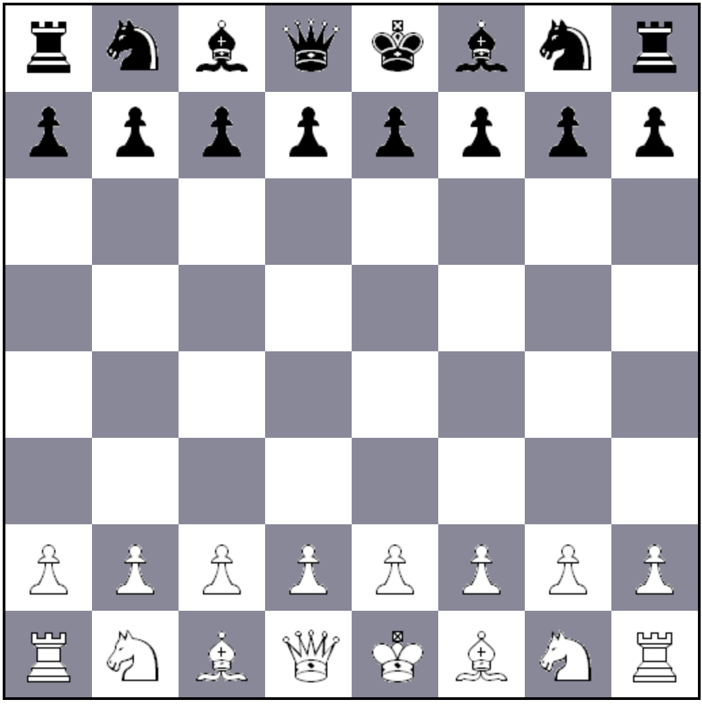

# JSP : Java Server Pages

## Objectif :

Ecrire et manipuler des Java Server Pages (JSP).  
L’avantage de Tomcat c’est qu’il accepte aussi bien des Servlets que des JSP. Les JSP se placent au même endroit que les pages HTML, c'est Tomcat qui s'occupe de les transformer en Servlets, de les compiler et de les exécuter.

Afin de repartir sur un contexte propre, créez un nouveau contexte `tpjsp`sous `webapps`

## Principe de base

1. Ecrire une page HTML `mapage.html` avec quelques lignes et quelques accents
    ```html
    <!DOCTYPE html>
    <html>
     <head>
       <meta http-equiv="Content-Type" content="text/html; charset=utf-8"/>
       <title> MaPage </title>
     </head>
     <body>
     <h1>Hello World</h1>
     avec quelques accents à é è ù
     </body>
    </html>
    ```
1. Visualizez cette page en HTTP via votre navigateur `http://localhost:8080/tpjsp/mapage.html`
1. Renommez cette page en `.jsp`
1. Visualizez cette page JSP en HTTP via votre navigateur `http://localhost:8080/tpjsp/mapage.jsp`  
La page s'affiche correctement, accents mis à part.  
**Explications :** La JSP est transformée en Servlet par Tomcat. La servlet standard utilisée par Tomcat utilise l'encodage Latin1. Le tag `meta` tel qu'il est mis dans cette page arrive "trop tard" pour être pris en compte.
1. Supprimez la ligne `meta` et placez en tête de votre fichier la directive de compilation :  
`<%@ page pageEncoding="UTF-8" %>`  
Cette fois tout doit s'afficher correctement.
1. Ajoutez un peu de code à votre JSP ... par exemple, juste après le `h1`
    ```jsp
    <% 
      for (int i = 1; i <= 9; i++) 
        out.println(i); 
    %>
    ```
1. Vérifiez que tout s'affiche correctement.
1. Ce test n'est pas anodin ! pour qu'elle puisse s'afficher cette page a été transformée en Servlet , puis compilée puis exécutée. 
1. Mais où est donc cette fameuse servlet ? Allez dans le répertoire  
`work/Catalina/localhost/tpjsp/org/apache/jsp`  
Vous y trouvez un fichier `mapage_jsp.java` et sa compilation `mapage_jsp.class`
1. Editez le fichier `mapage_jsp.java`. En le parcourant, vous trouverez notamment, (ligne 11) les import classiques, (ligne 15) la définition de la classe, (ligne 38) la méthode de service avec nos deux paramètres habituels, (ligne 47) la définition des objets implicites, (ligne 105) la création de ces objets implicites, (ligne 62) votre code HMTL, (ligne 77 le code Java que vous avez placé dans la JSP.

**Une JSP est donc bien ni plus ni moins qu'une Servlet. ça n'est qu'une autre manière de l'écrire !**

<p style="page-break-after: always;"/>

## L'accès à une base de données

Vous savez maintenant placer du code dans une JSP, Essayons maintenant d'accéder à la base de données.  
Créez une JSP `mabase.jsp` permettant d'afficher le contenu d'une de vos tables SGBD (au choix, sans métabase) dans une table HTML. Vous aurez évidemment besoin pour cela
   1. de directives de compilation pour les import `<@ page import ... >`
   1. de scriplets JSP `<% ... %>`
   1. de JSP expressions `<%= ... %>`


## L'accès à un objet

Les objets (quels qu'ils soient) **doivent** être dans le répertoire `WEB-INF/classes`. Mais pour pouvoir être référencés d'une JSP, ils *doivent* être placés impérativement dans un package.

1. Créez un répertoire `metier` dans `WEB-INF/classes`
1. Créez dedans l'objet `Personne.java` avec le code suivant :  
    ```java
    package metier;
    public class Personne {
        private int i;
        public Personne() { i=0; }
        public String toString() { i++; return "C'est le "+i+"ème Hello World !"; }
    }
    ```
1. Compilez cet objet ! Si les JSP se débrouillent seules, c'est quand même à vous de compiler vos objets ;-)
1. Créez une JSP `monobjet.jsp` qui instancie cet objet (pensez au `import`) et qui permet de l'afficher.
1. Rechargez plusieurs fois cette page. Le compteur placé dans l'objet s'incrémente t-il ?
  1. Comment faire pour que ce compteur soit propre à chaque utilisateur ?
  1. Comment faire pour que ce compteur soit global à tous les utilisateurs ?

Vous savez maintenant creer une JSP, mettre du code et des directives de compilation. Vous savez invoquer vos propres objets.  
On utilisera plutot une JSP quand il y a peu de code et beaucoup d'HTML.  
On utilisera plutot une Servlet quand il y a peu d'HTML et beaucoup de code.


## Le jeu du Saute-Moutons

Pour réaliser cet exercice, téléchargez l'archive `tp_chess.zip` à décompresser dans votre répertoire `webapps`.

Le casse-tête du Saute-Mouton se joue sur un plateau de 7 cases, avec 3 moutons noirs à gauche et 3 moutons blancs à droite. Les moutons de gauche avancent toujours vers la droite, les blancs toujours vers la gauche. L'objectif est d'inverser leurs positions sachant qu'un mouton n'a que 2 possibilités : soit avancer sur une case vide, soit sauter au dessus d'un mouton de couleur différente pour tomber sur une case vide. Le casse-tête se termine avec succès si les 3 blancs sont à gauche et les 3 noirs à droite. Si les moutons sont bloqués, c'est un échec.


La classe `Casse-Tete` fournie dans cette archive contient 4 méthodes : `destination(i)`, `estFini()`, `gagne()`, `get(i)`, `jouer(i)` . Son constructeur crée un plateau de 7 cases  avec trois pions blancs à droite, trois pions noirs à gauche. En interne cette classe code les pièces par un caractère 'B' , 'N' ou ' '. Cette classe ne permet que de jouer, pas d'afficher quoi que ce soit. Pour jouer une pièce on indique aux méthodes son numéro d'ordre à partir de la gauche, numéroté à partir de 0. Regarder la javadoc qui est fournie.
1. Ecrire un programme Java classique qui permet de jouer à ce jeu dans la console : (saisie d'un numéro et affichage en toString). Ce programme doit bien évidemment n'accepter que des coups autorisés, et s'arrête en indiquant "casse-tete réussi" ou "bloqué" en offrant la possibilité de recommencer une partie.
2. Transformation d'un programme séquentiel en application web évènementielle.
    1. Pour afficher un plateau dans une page HTML, une CSS `style.css` vous est fournie. Un plateau de jeu doit être défini dans une `div` de classe `plateau`,  chaque case dans une balise `p` , case qui peut éventuellement etre noire avec la balise `noir`. Chaque pièce est indiquée dans sa case par une une balise `i` de classe "pion blanc" ou "pion noir".
En résumé une case vide s'écrit `<p></p>` , une case avec un pion noir `<p> <i class="pion noir"></i> </p>` . `demo1.html` vous fournit un exemple d'un plateau de jeu.
Regardez attentivement le source et le rendu du fichier `demo1.html`
    2. Ecrire une JSP `moutons.jsp` qui permet d'afficher un plateau issu de l'objet `Casse-Tete` en itérant sur les 7 cases avec la méthode `get`. Cet objet sera déclaré et instancié en attribut de JSP à l'aide des balises `<%! ... %>` afin d'être initialisé au premier accès.
    3. Completez cette JSP pour qu'elle permette de jouer et d'afficher les résultats dans le navigateur. On englobera pour cela les balises `<i>`par des `href`qui permettent de rappeler la même page en passant en paramètre le coup joué : si il existe et si ce pion peut être joué, on déplace ce pion à l'aide de la méthode `jouer`

## Un plateau d'échecs

De manière identique à l'exercice précédent, la librairie `chesslib-1.1.8.jar` permet de jouer aux échecs. La feuille de styles fournie permet d'afficher les pieces d'un jeu d'échecs avec les styles pion, cavalier, fou, tour, reine et roi associés à blanc ou noir. Le fichier `demo2.html`vous donne un exemple d'utilisation.
1. Regardez attentivement le source et le rendu du fichier `demo2.html`
1. Ecrire une JSP qui affiche le plateau de jeu initial créé avec l'instanciation de la classe `Board` de cette librairie. 
   1. Il sera necessaire pour cela d'importer les classes de cette librairie `com.github.bhlangonijr.chesslib.*`. 
   1. La balise `<i>`, créée si la pièce existe (différente de NONE) aura pour classe "pion", "tour", "cavalier", "fou", "dame" ou "roi" selon le type de pièce obtenu par `piece.getPieceType()` qui est PAWN (pion), ROOK (tour), BISHOP (fou), KNIGHT (cavalie), QUEEN (dame), KING (roi). On ajoutera également la classe "blanc" ou "noir" sur le même élément `<i>` selon la couleur de la piece `piece.getPieceSide()` qui renvoit BLACK ou WHITE
   1. Attention la case en bas à gauche de l'échiquier doit être "A1" (elle est blanche), celle en haut à droite sera donc "H8".
   
<center></center>
